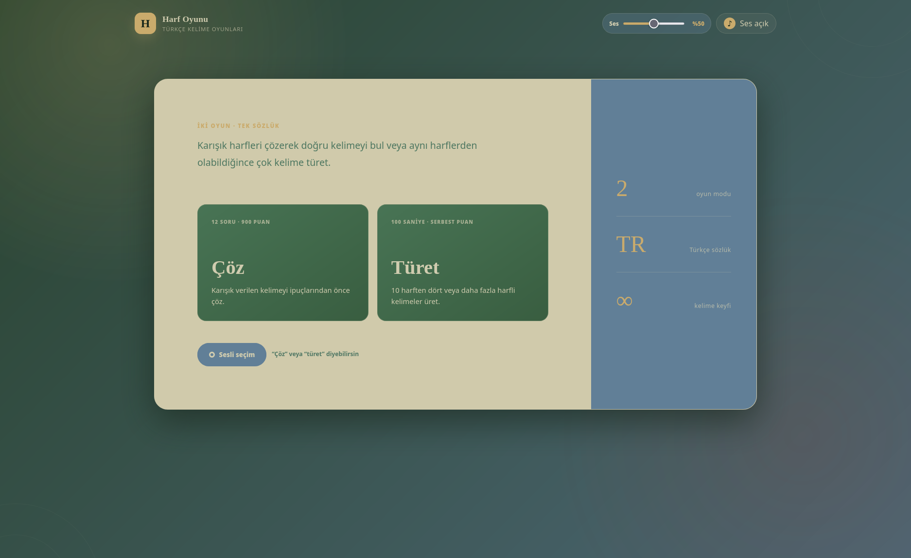

<div align="center">

# Harf Oyunu

### Çöz · Türet · Söyle

Karışık harfleri çözün veya on harften yeni kelimeler türetin. Türkçe odaklı, hızlı ve sesle de oynanabilen iki oyun bir arada.

[🎮 Hemen oyna](https://kavalmesut.github.io/harf_oyunu/)




</div>

## Oyun modları

| Mod | Nasıl oynanır? | Hedef |
| --- | --- | --- |
| **Çöz** | Karışık verilen harfleri doğru sıraya getirin. | 12 soruyu, ipuçları açılmadan çözerek 900 puana yaklaşın. |
| **Türet** | Dört sesli ve altı sessiz harften oluşan 10 harfi kullanın. | 100 saniye içinde mümkün olduğunca çok 4+ harfli Türkçe kelime bulun. |

**Türet** modunda en uzun kelimeler çift puan getirir. Tur sonunda tüm olası kelimeler; bulunanlar yeşil, kaçırılanlar kırmızı olacak şekilde gösterilir.

## Öne çıkanlar

- Tek ekranda iki farklı Türkçe kelime oyunu
- Türkçe karakterler için doğru normalizasyon: `ç`, `ğ`, `ı`, `İ`, `ö`, `ş`, `ü`
- Sürekli sesli oyun: mod seçimi ve kelime tahminleri eller serbest yapılabilir
- **Çöz** modunda beş saniyede bir açılan sıralı harf ipucu animasyonu
- **Türet** modunda çözülebilir kelimeler sunan dengeli 10 harflik raflar
- Tekrar kelimelerde ayrı uyarı sesi ve görsel vurgulama
- Ses seviyesi, ses kapatma ve yerel ses efektleri
- Masaüstü ve mobil ekranlar için uyumlu arayüz
- Harici framework veya paket gerektirmez

## Hızlı başlangıç

### Linux — tek tıkla

Proje klasöründeki **`Harf_Oyunu.desktop`** dosyasını çalıştırın. İlk seferde dosya yöneticiniz güvenme ya da çalıştırılabilir yapma izni isteyebilir; onaylayın. Başlatıcı yerel sunucuyu açar ve oyunu varsayılan tarayıcıda başlatır.

> Python 3 ve `xdg-open` gereklidir. Çoğu Linux dağıtımında hazır gelir.

### Windows — tek tıkla

Proje klasöründeki **`Harf_Oyunu_Baslat.bat`** dosyasına çift tıklayın.

> Python veya Python Launcher kurulu olmalıdır.

### Terminalden çalıştırma

```bash
python3 -m http.server 8000
```

Ardından tarayıcıdan `http://localhost:8000` adresini açın.

> `index.html` dosyasını doğrudan açmayın. Kelime listelerinin yüklenebilmesi için uygulama bir HTTP sunucusu üzerinden çalışmalıdır.

## Sesle oyna

1. Ana ekrandaki **Sesli seçim** düğmesine basın ve tarayıcının mikrofon iznini verin.
2. **“Çöz”** veya **“Türet”** diyerek oyun modunu seçin.
3. Oyun sırasında kelimeyi söyleyin. Kesinleşen tahmin otomatik olarak denenir ve mikrofon sıradaki tahmin için yeniden dinlemeye geçer.

Web Speech API desteği tarayıcıya göre değişir. Klavye ile oyun her zaman kullanılabilir; sesli tanıma bazı tarayıcılarda internet bağlantısı gerektirebilir.

## Puanlama

### Çöz

| Kelime uzunluğu | Başlangıç puanı | Soru sayısı |
| ---: | ---: | ---: |
| 5 harf | 50 | 2 |
| 6 harf | 60 | 2 |
| 7 harf | 70 | 2 |
| 8 harf | 80 | 2 |
| 9 harf | 90 | 2 |
| 10 harf | 100 | 2 |
| **Toplam** | **900** | **12** |

Her ipucu, o sorunun puanını 10 azaltır.

### Türet

- Her geçerli kelime: `harf sayısı × 10` puan
- En uzun kelime: `harf sayısı × 10 × 2` puan
- Aynı kelime yalnızca bir kez puan getirir.

## Proje yapısı

```text
harf_oyunu/
├── index.html                    # Uygulama arayüzü
├── style.css                     # Tasarım, düzen ve animasyonlar
├── script.js                     # Oyun, ses ve sesli tahmin mantığı
├── turkce_kelime_listesi_sik_kulanilan_5000.txt # Çöz modunun sık kullanılan kelime havuzu
├── turkce_kelime_listesi.txt     # Türet modunun Türkçe sözlüğü
├── assets/
│   ├── harf-oyunu.png            # Ekran görüntüsü
│   ├── cheering.wav              # En uzun kelime bonus sesi
│   ├── correct.mp3
│   ├── hint.mp3
│   ├── start.mp3
│   └── wrong.mp3
├── Harf_Oyunu.desktop            # Linux başlatıcısı
├── Harf_Oyunu_Baslat.bat         # Windows başlatıcısı
└── README.md
```

## Geliştirme

JavaScript yapısını kontrol etmek için:

```bash
node --check script.js
```

Oyun davranışını değiştirirken özellikle Türkçe karakter karşılaştırmasını, sesli modun ardışık dinlemesini, ipucu zamanlayıcılarını ve Türet modundaki harf sayısı doğrulamasını test edin.

---

<div align="center">

**Harf Oyunu** · Harflerle düşün, kelimelerle oyna.

</div>
