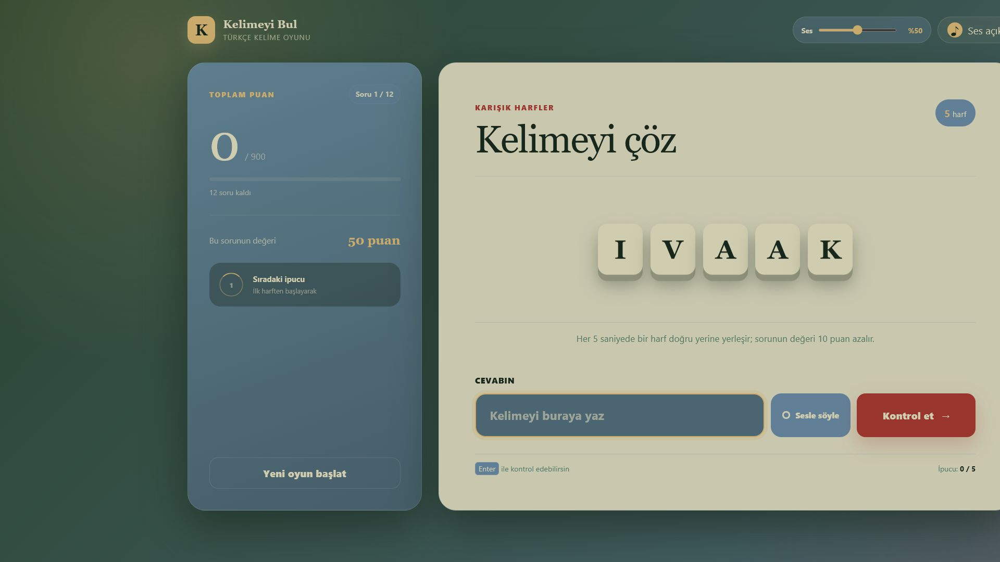

<div align="center">

# SözDiz

### Harfleri diz, sözü bul.

Modern, hızlı ve Türkçe odaklı bir kelime çözme oyunu.


</div>

## Ekran görüntüsü



## Oyun hakkında

SözDiz, karışık verilen Türkçe harfleri doğru sıraya getirerek kelimeyi bulmaya çalıştığınız 12 soruluk bir tarayıcı oyunudur. Sorular 5 harfli kelimelerle başlar ve aşamalı olarak 10 harfe kadar ilerler.

Her beş saniyede bir harf animasyonla doğru konumuna yerleşir. Ne kadar erken cevap verirseniz o kadar fazla puan kazanırsınız.

## Öne çıkan özellikler

- 5, 6, 7, 8, 9 ve 10 harfli kelimelerden oluşan sabit zorluk akışı
- Her oyun için rastgele ve tekrarsız kelime seçimi
- Türkçe `i`, `ı`, `İ`, `I`, `ç`, `ğ`, `ö`, `ş` ve `ü` karakterleriyle doğru karşılaştırma
- Harf kimliklerini koruyan akıcı FLIP ipucu animasyonu
- Her beş saniyede bir açılan sıralı harf ipuçları
- 900 puan üzerinden hesaplanan skor ve başarı oranı
- Web Audio API ile üretilen, seviyesi ayarlanabilir oyun sesleri
- Desteklenen tarayıcılarda anlık Türkçe sesli tahmin
- Açıldığında sorular arasında etkin kalabilen sürekli sesli tahmin modu
- Başlangıç ve sonuç ekranlarında “yeni oyun başlat” sesli komutuyla oyunu başlatma
- Tüm harfler açıldığında otomatik olarak sonraki kelimeye geçiş
- Masaüstü ve mobil ekranlara uyumlu tasarım
- Harici framework, font, ikon veya ses dosyası olmadan çalışma

## Hızlı başlangıç

### Windows — tek tıkla

Proje klasöründeki **`Oyunu_Baslat.bat`** dosyasına çift tıklayın.

Başlatıcı:

1. Yerel sunucu çalışmıyorsa arka planda başlatır.
2. Sunucu zaten çalışıyorsa ikinci bir kopya oluşturmaz.
3. Oyunu varsayılan tarayıcınızda açar.

> [!NOTE]
> Bilgisayarınızda Python veya Python Launcher kurulu olmalıdır.

### Python ile

Proje klasöründe bir terminal açın:

```bash
python -m http.server 8000
```

Ardından şu adresi ziyaret edin:

```text
http://localhost:8000
```

### VS Code Live Server ile

1. Proje klasörünü VS Code ile açın.
2. **Live Server** eklentisini kurun.
3. `index.html` dosyasına sağ tıklayın.
4. **Open with Live Server** seçeneğini kullanın.

> [!IMPORTANT]
> `index.html` dosyasını doğrudan `file://` adresiyle açmayın. Tarayıcı güvenlik kuralları, kelime listesinin `fetch()` ile okunmasını engelleyebilir.

## Nasıl oynanır?

1. **Oyuna başla** düğmesine basın.
2. Karışık harflerden doğru Türkçe kelimeyi bulun.
3. Cevabınızı klavyeyle yazın veya **Sesle söyle** seçeneğini kullanın.
4. Klavyede `Enter` tuşuna basın ya da **Kontrol et** düğmesini seçin.
5. İpuçları açılmadan cevap vererek mümkün olan en yüksek puanı kazanın.

| Kelime uzunluğu | Başlangıç puanı | Soru sayısı |
|---:|---:|---:|
| 5 harf | 50 | 2 |
| 6 harf | 60 | 2 |
| 7 harf | 70 | 2 |
| 8 harf | 80 | 2 |
| 9 harf | 90 | 2 |
| 10 harf | 100 | 2 |
| **Toplam** | **900** | **12** |

Her açılan ipucu harfi, sorudan alınabilecek puanı 10 azaltır. Yanlış cevap doğrudan puan kaybettirmez.

## Sesli tahmin

Sesli tahmin, tarayıcının Web Speech API desteğini kullanır.

- Tanıma dili `tr-TR` olarak ayarlanır.
- Konuşma sırasında ara sonuç cevap kutusunda gösterilir.
- Ara sonuç kutuda gösterilir; kullanıcı sözünü bitirdikten sonra kesinleşen tahmin onay beklemeden otomatik olarak denenir.
- Sürekli mod bir kez açıldığında yeni sorularda kendiliğinden devam eder.
- Başlangıç ve sonuç ekranlarında sesli mod açıksa “yeni oyun başlat” veya “oyuna başla” demek oyunu başlatır.
- Tercih tarayıcıda saklanır ve aynı düğmeyle kapatılabilir.
- İlk kullanımda tarayıcı mikrofon izni ister.

Sesli tanıma desteği ve doğruluğu tarayıcıya göre değişebilir. Klavye girişi her zaman kullanılabilir. Tarayıcı, ses tanıma için internet bağlantısı gerektirebilir; oyunun klavye ile oynanan temel akışı çevrimdışı çalışır.

## Kelime listesi

Oyun, günlük kullanım için süzülmüş `turkce_kelime_listesi_gunluk.txt` dosyasını yükler. Varsayılan havuzda yaygın mastar fiiller bulunur; 8–10 harf gruplarında mastar ve diğer kelimelerin sayısı eşittir, böylece uzun sorular çeşitli kalır. Dosya UTF-8 kodlamalı olmalı ve her satırda tek bir kelime bulunmalıdır. Tam TDK madde başlığı arşivi olan `turkce_kelime_listesi.txt` korunur; istenirse daha geniş bir havuz için tekrar kullanılabilir.

```text
bağıl
kavram
devinim
paradoks
görelilik
simülasyon
```

Oyun yükleme sırasında:

- Baştaki ve sondaki boşlukları temizler.
- Boş satırları atlar.
- Tekrarlanan kelimeleri birleştirir.
- Kelimeleri Türkçe büyük harfe dönüştürür.
- Yalnızca Türkçe harflerden oluşan kelimeleri kabul eder.
- Sadece 5–10 harfli kelimeleri oyuna dahil eder.
- Her uzunluk için en az iki geçerli kelime bulunmasını zorunlu tutar.

## Proje yapısı

```text
kelime_bulma/
├── index.html                  # Uygulama arayüzü
├── style.css                   # Tasarım ve animasyonlar
├── script.js                   # Oyun, ses ve sesli tahmin mantığı
├── turkce_kelime_listesi_gunluk.txt # Oyunda kullanılan günlük kelime havuzu
├── turkce_kelime_listesi.txt   # Tam Türkçe kelime arşivi
├── Oyunu_Baslat.bat            # Windows tek tık başlatıcı
└── README.md
```

## Teknik ayrıntılar

- Saf HTML5, CSS3 ve JavaScript
- Web Audio API
- Web Speech API
- Fisher–Yates harf karıştırma
- Web Animations API ile FLIP hareketleri
- Unicode güvenli karakter sayımı
- Türkçe yerel büyük harf normalizasyonu
- Tarayıcı `localStorage` alanında sesli tahmin tercihi

## Geliştirme

Kod değişikliklerinden sonra JavaScript sözdizimini kontrol etmek için:

```bash
node --check script.js
```

Oyunun temel akışını test ederken özellikle şunları doğrulayın:

- Aynı oyunda kelimelerin tekrarlanmaması
- İpucunda doğru harf kutusunun hareket etmesi
- Birden fazla ipucu zamanlayıcısının oluşmaması
- Türkçe karakterlerin doğru karşılaştırılması
- On harfli kelimelerin mobil ekranda taşmaması
- Sesli tahmin kapatıldığında otomatik dinlemenin durması

---

<div align="center">

**SözDiz** · Harfleri diz, sözü bul.

</div>
